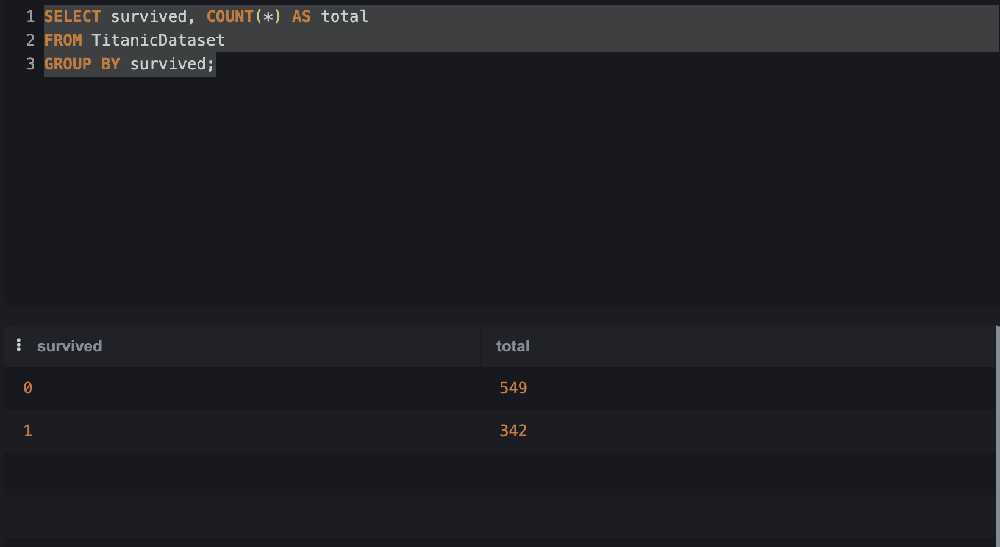

# Titanic_Kaggle
Titanic Project using SQL


---

### Project Introduction 
By analyzing the Titanic dataset, I aim to identify the key factors that influenced passenger survival during the disaster.
The analysis focuses on variables such as gender, passenger class, age, and embarkation point to understand patterns and differences in survival rates.

The goal of this project is to apply SQL queries to extract meaningful insights and simulate real-world data analysis scenarios, supporting data-driven conclusions.

Data Quality Note: Missing values were identified in the Age and Cabin columns. These were considered during the analysis, with null values handled appropriately to avoid distortion in the results.

---


### How many passenger have in Titanic

```
code:
Select count(*) from TitanicDataset;
```

In Titanic Dataset we have 891 passengers.

---
### How many passenger survived and didn't survived in Titanic.

```
code:
SELECT survived, COUNT(*) as total
FROM TitanicDataset
GROUP BY survived;
```

In Titanic we have two numbers 0 and 1. 0 din't survivced and 1 survived. In this case 549 din't survived and 342 survived.

<table>
  <tr>
    <td align="center">
      <a href="#" title="Age">
        <br>
      </a>
    </td>
  </tr>
</table>

---

Qual é a porcentagem de sobreviventes no total?
Quantos homens e quantas mulheres existem?
Quantas pessoas embarcaram em cada porto (embarked)?
🟡 Nível Básico + (já começa a diferenciar)
Qual a quantidade de sobreviventes por gênero?
Qual a taxa de sobrevivência por gênero (%)?
Quantos passageiros existem por classe (pclass)?
Qual a taxa de sobrevivência por classe (%)?
Qual a média de idade dos passageiros?


### Adjustments and improvements.

The project is still under development, and the upcoming updates will focus on the following tasks:

- [x] Advanced courses about SQL

The following tools were used in the construction of the project:

- [SQL](<[https://www.python.org/doc//](https://sqliteonline.com/)>)
- [Google colab](<https://colab.google/>)


## 🤝 Creator

<table>
  <tr>
    <td align="center">
      <a href="#" title="Thales Farias">
        <br>
        <sub>
          <b><a href="https://www.linkedin.com/in/thalesfreirefarias/" target="_blank">Thales Farias</b>
        </sub>
      </a>
    </td>
  </tr>
</table>

